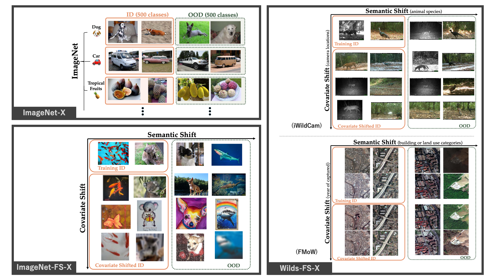

# OOD-X-Banchmarks



## Get Started

### Installation


This benchmark now supports installation via poetry.

```
# install third party sources

mkdir third_party && cd third_party
git clone git@github.com:KaiyangZhou/Dassl.pytorch.git

# installation via poetry
poetry lock
poetry install
poetry shell

```


### Data

Please create `data` folder and download the following ID and OOD datasets to `data`.
Then, prepare the dataset as follows.


The overall file structure is as follows:


```
root
|-- data
    |-- imagenet
        |-- imagenet-classes.txt
        |-- images/
            |--train/ # contains 1,000 folders like n01440764, n01443537, etc.
            |-- val/ # contains 1,000 folders like n01440764, n01443537, etc.
    |-- imagenet_v2
    |-- imagenet_r
    |-- imagenet_c
    |-- iwildcam_v2.0
    |-- fmow_v1.1
    ...
```


#### ImageNet-1k

Download datas. 

1. Create a folder named `imagenet/` under `data` folder.
2. Create `images/` under `imagenet/`.
3. Download the dataset from the [official website](https://image-net.org/index.php) and extract the training and validation sets to `$DATA/imagenet/images`.

Download metadatas and put under  `data/imagenet` folder.

- `classnames.txt`: https://drive.google.com/file/d/1-61f_ol79pViBFDG_IDlUQSwoLcn2XXF/view
- `wordnet_is_a.txt`: http://www.image-net.org/data/wordnet.is_a.txt
- `words.txt`: http://www.image-net.org/data/words.txt


#### ImageNet derived datasets

Download ImageNet-V2, ImageNet-R, ImageNet-C.

```
cd data_managment/imagenet
python download_variance.py
```


#### Wilds

Download iWilCam and FMoW.

```
cd data_managment/wilds
python download.py
```


### Training and evaluation

We provide training and evaluation scripts in `scripts` folder.
After navigating to the directory containing the relevant script file, execute the script.


## Supported Benchmarks


### ImageNet-X


#### About


ImageNet-X is a benchmark that splits the ImageNet-1k.
This benchmark enables a precise evaluation of sensitivity to semantic shifts by separating semantically similar labels into ID and OOD categories.
Based on the WordNet hierarchy, closely related labels were separated into ID and OOD.
(Refer to `data_managment/imagenet/make_split_list.py` for the split method.)


#### Run scripts

Replace the `--eval_full_supectrum_ood` option with `--eval_ood`.

```
bash imagenet.sh
```


### ImageNet-FS-X
#### About


ImageNet-FS-X incorporates covariate shift into ImageNet-X.
Derived datasets from ImageNet-1k are used as data with different covariate distributions. 


#### Run scripts


```
bash imagenet.sh
```

### Wilds-FS-X (iWildCam)
#### About


Wilds-FS-X is a benchmark that brings the problem setting of ImageNet-FS-X closer to real-world scenarios by utilizing [Wilds](https://wilds.stanford.edu/datasets/).
iWildCam is a dataset of wildlife photos taken by camera traps.
Semantic shift corresponds to different animal species, and covariate shift corresponds to changes in camera locations of camera photos.

#### Run scripts


```
bash iwildcam.sh
```

### Wilds-FS-X (FMoW)
#### About


FMoW is a RGB satellite image dataset. 
Semantic shift corresponds to the building or land use categories, and covariate shift corresponds to changes in the year when the images were captured.

#### Run scripts


```
bash fmow.sh
```


## Supported Methods

This part lists all the methods we include in this codebase.

- [MCM](https://arxiv.org/abs/2211.13445)
- [GL-MCM](https://arxiv.org/abs/2304.04521)
- [CoOp](https://arxiv.org/abs/2109.01134)
- [LoCoOp](https://arxiv.org/abs/2306.01293)

